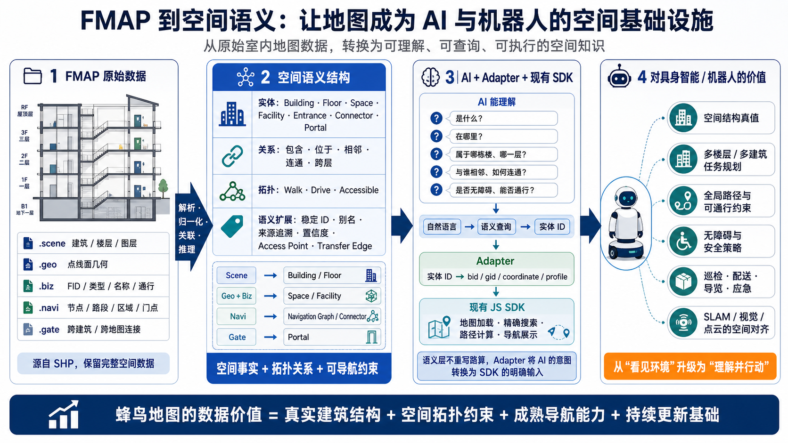
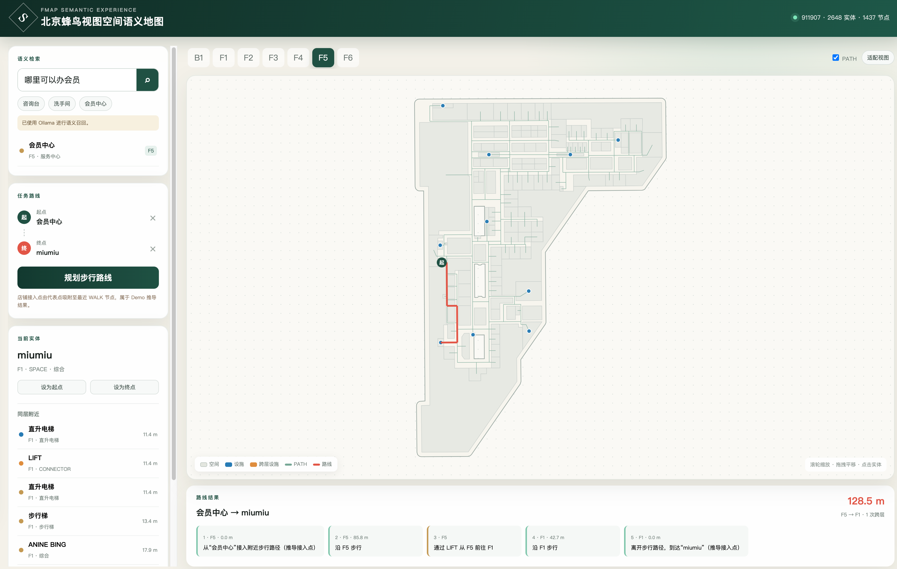

# 蜂鸟视图室内语义化地图测试数据集

> 数据集版本：v1.0<br>
> 语义格式规范版本：v0.2<br>
> 发布日期：2026 年 8 月 14 日<br>
> 数据规模：5 张室内地图、37 个楼层  
> 使用范围：仅限非商业性质的学习、研究、教学和技术验证

## 项目简介

蜂鸟视图室内语义化地图 — 测试数据集 是一套面向室内空间理解、空间关系分析、地图 SDK 集成和导航应用验证的测试数据集。

数据集选取 5 个真实大型商业空间，共覆盖 37 个楼层。每个测试场景包含标准语义化结构测试包、使用蜂鸟地图 SDK 加载地图的 Web Demo，以及各楼层地图截图。

本数据集由蜂鸟视图基于自主采集的室内地图数据进行整理、加工和语义化生产，主要用于验证室内地图从几何数据向实体、关系和导航拓扑结构转换的可用性，并为开发者提供格式解析、地图展示和应用集成参考。



*图：从原始室内地图数据出发，形成可理解、可查询、可执行的空间语义结构，并与现有地图 SDK 及 AI、机器人应用衔接。*

## 数据集概览

| 项目 | 内容 |
| --- | --- |
| 数据集名称 | 蜂鸟视图室内语义化地图测试数据集 |
| 数据集版本 | v1.0 |
| 发布日期 | 2026 年 8 月 14 日 |
| 测试场景 | 5 张真实室内地图 |
| 楼层总数 | 37 层 |
| 语义格式规范版本 | v0.2 |
| 地图类型 | 大型商业空间室内地图 |
| 主要内容 | 语义化结构测试包、SDK Web Demo、逐层地图截图、数据集使用 demo |
| 主要用途 | 格式解析、空间查询、地图展示、SDK 集成、导航与算法验证 |
| 使用性质 | 仅限非商业使用 |

## 数据集内容

### 1. 标准语义化结构测试包

每张地图提供一份符合《标准语义地图输出 v0.2》的语义化结构测试包。测试包用于表达楼层、空间、设施、跨层连接设施、导航路径，以及实体之间的空间关系和导航拓扑。

公开测试包将标准语义数据与楼层截图分开存放，避免展示资源进入标准语义地图目录：

```text
fengmap-semantic-sample-dataset-v1.0/
├── semantic/
│   └── {mapId}/
│       ├── manifest.json
│       ├── entities.json
│       ├── relations.jsonl
│       └── navigation/
│           ├── nodes.jsonl
│           └── edges.jsonl
└── floor-images/
    └── {mapId}/
        └── {floorName}.png
```

主要文件说明：

| 文件 | 说明 |
| --- | --- |
| `manifest.json` | 记录版本、地图、坐标系、楼层、数据规模和文件完整性信息 |
| `entities.json` | 记录楼层、空间、设施、跨层设施和导航路径等语义实体 |
| `relations.jsonl` | 记录实体之间的包含、归属、服务和连接关系 |
| `navigation/nodes.jsonl` | 记录导航图节点、跨层设施节点和空间接入点 |
| `navigation/edges.jsonl` | 记录楼层内路径及跨楼层换乘连接 |

完整字段、类型和约束请参阅[《标准语义地图输出 v0.2》](标准语义输出-v0.2.md)。

### 2. 楼层地图截图

数据集提供全部 5 个测试场景、共 37 个楼层的地图截图。截图用于快速了解地图覆盖范围、楼层结构、地图渲染效果和场景差异。

### 3. JS-SDK Web Demo

测试场景提供一个使用蜂鸟地图 JS SDK 加载地图的 Web Demo，用于展示标准 `.fmap` 格式地图的基本使用方式：

- 地图初始化与资源加载；
- 楼层切换；
- 地图缩放、旋转和视角控制；
- 店铺、空间及设施的地图展示；
- 5 张测试地图之间的切换；
- 通过地图点击设置起点、终点并进行步行路线规划。

Demo 源码、5 张 `.fmap` 测试地图及配套主题文件位于 [`js-sdk-demo/`](./js-sdk-demo/)，运行方法参见 [JS SDK Demo 使用说明](./js-sdk-demo/README.md)。

### 4. 基于测试包的演示 demo

[`java-semantic-map-demo/`](./java-semantic-map-demo/) 是一个基于标准语义地图 v0.2 测试包构建的独立 Java 演示程序。它使用 Spring Boot 读取 `SampleDataSet` 数据，直接展示语义结构在空间查询、自然语言检索和路径规划中的使用方式。

主要演示能力包括：

- 按楼层绘制空间、设施、跨层设施和导航路径；
- 按品牌、设施名称或自然语言需求检索实体；
- 查询同楼层附近的店铺和设施；
- 将语义实体设置为路线起点或终点；
- 使用导航节点和有向边计算同层及跨层步行路线；
- 展示路线距离、跨层换乘和分层文字步骤；
- 可选接入 Ollama Embedding 进行语义召回，未配置时使用离线规则检索。



*图：Java Demo 使用语义实体、导航节点和导航边完成自然语言检索、邻近查询及跨楼层路径规划。*


## 数据用途

本测试数据集可用于以下非商业用途：

- 学术研究、课程教学和毕业设计；
- 室内地图数据格式解析与转换验证；
- 空间实体、空间关系和导航拓扑研究；
- 基于真实物理空间的数据合成依据；
- AI、机器人和空间智能相关的概念验证；
- 开源、公益或内部非营利性质的技术测试。

本数据集不是生产地图服务，不应作为商场实时运营信息、消防疏散依据、应急指挥依据或其他安全关键系统的唯一数据来源。

## 数据获取

本仓库公开提供 5 张地图的语义化测试包、37 张楼层截图、JS SDK Demo 和 Java 语义地图 Demo：

- [下载语义地图测试数据集（v1.0，语义格式规范 v0.2）](https://github.com/fengmap/semantic-sample-dataset/releases/download/v1.0/fengmap-semantic-sample-dataset-v1.0.zip)
- [查看 JS SDK Demo](./js-sdk-demo/)
- [查看 Java 语义地图 Demo](./java-semantic-map-demo/)

如需了解或获取更多相关数据，请通过以下方式联系蜂鸟视图：

- 联系邮箱：[developer@fengma.com](mailto:developer@fengma.com)
- 400 电话：[400-680-0432](tel:4006800432)

## 非商业使用声明

本测试数据集仅限非商业性质的学习、研究、教学、公益活动和技术验证使用。未经蜂鸟视图事先书面许可，不得将本测试数据集的全部或部分内容用于任何直接或间接的商业目的，包括但不限于：

- 作为收费产品、商业服务或商业解决方案的组成部分；
- 以出售、出租、转授权、付费下载或其他方式向第三方提供；
- 用于商业项目交付、商业咨询、商业宣传或市场营销；
- 用于训练、评估或改进以商业运营为主要目的的数据产品、模型或服务；
- 删除、遮盖或修改本项目中的权利声明后进行再发布。

引用、展示或使用本数据集时，应注明数据集名称、版本及来源。Demo 程序代码、蜂鸟地图 SDK 和第三方依赖如有单独许可证或使用条款，应同时遵守相应条款。

## 数据所有权及来源说明

本数据集所使用的室内地图数据由蜂鸟视图自主采集，并由蜂鸟视图完成地图生产、整理、结构化加工、语义转换和测试验证。在适用法律允许的范围内，本数据集及其结构化成果的相关权利归蜂鸟视图所有。

数据中的店铺名称、品牌名称、商标、字号及其他第三方标识未统一脱敏，其相关权利归各自权利人所有。此类信息仅用于呈现地图数据采集时的场景状态和验证地图展示效果，不表示蜂鸟视图与相关品牌之间存在授权、推荐、合作或商业关联。

未经许可，使用者不得利用本数据集中的布局、名称、品牌组合或其他信息识别、公开或传播未披露的具体商场身份，也不得将第三方品牌标识用于宣传、背书或其他与本测试目的无关的用途。

## 免责声明

1. 本数据集以“现状”和“可提供”的状态发布，主要用于非商业测试、研究和技术交流。蜂鸟视图不对数据的完整性、实时性、准确性、适销性、特定用途适用性或持续可用性作出明示或默示保证。
2. 室内空间、楼层布局、店铺名称、设施状态和通行条件可能随时间发生变化。本数据集仅反映采集、生产或发布时的数据状态，不代表相关场所的当前实际情况。
3. 语义实体、空间关系和导航拓扑由地图数据经过程序化处理生成，不等同于逐项人工确认的实时真值。使用者应根据具体应用自行验证数据质量和适用范围。
4. 本数据集不得作为消防、应急疏散、生命安全、公共安全、自动驾驶或其他安全关键决策的唯一依据。
5. 使用者应自行确保其下载、存储、处理、展示和使用行为符合所在地适用的法律法规、行业要求及第三方权利要求。
6. 在适用法律允许的最大范围内，蜂鸟视图不对因使用、无法使用、误用或依赖本数据集而产生的任何直接或间接损失承担责任。
7. 蜂鸟视图有权根据数据质量、权利要求、安全要求或项目安排，对数据内容、公开范围、获取方式和使用条件进行更新、调整、替换或停止提供。

## 版本记录

### v1.0 — 2026-08-14

- 首次发布项目介绍和数据集说明；
- 公布 5 张室内地图、37 个楼层的总体规模；
- 发布标准语义输出 v0.2 说明；
- 提供 SDK Web Demo、Demo 程序代码和逐层地图截图；
- 提供标准语义化结构测试包的公开下载附件。
