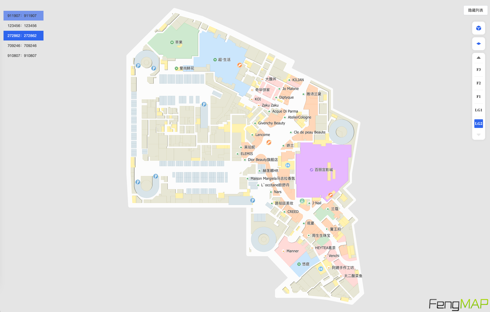

# 蜂鸟地图 JS SDK Demo

本目录提供蜂鸟视图室内语义化地图测试数据集配套的 JS SDK Web Demo，用于展示 5 张 `.fmap` 测试地图的加载、楼层浏览、地图交互和步行路线规划。



## 演示内容

- 加载本地 `.fmap` 地图和主题资源；
- 在 5 张测试地图之间切换；
- 切换楼层和全楼层显示模式；
- 缩放、旋转、拖动和调整地图视角；
- 展示店铺、空间和公共设施；
- 第一次点击地图设置路线起点；
- 第二次点击地图设置路线终点并规划步行路线；
- 第三次点击地图清除已有路线并开始新的规划。

## 目录结构

```text
js-sdk-demo/
├── index.html
├── jssdk-demo.png
├── data/
│   ├── maps/
│   │   ├── 123456/123456.fmap
│   │   ├── 272862/272862.fmap
│   │   ├── 709246/709246.fmap
│   │   ├── 910807/910807.fmap
│   │   └── 911907/911907.fmap
│   └── themes/
│       └── 2001/
└── libs/
    ├── fengmap.map.min.js
    ├── fengmap.analyser.min.js
    ├── fengmap.plugin.navi.min.js
    ├── fengmap.plugin.ui.min.js
    └── ...
```

## 运行环境

Demo 是静态 Web 项目，不需要 Node.js、数据库或后端服务。由于页面使用 JavaScript Module 加载 SDK，建议通过本地 HTTP 服务访问，不要直接双击 `index.html`。

可以在本目录执行：

```bash
python3 -m http.server 8080
```

然后在浏览器访问：

```text
http://localhost:8080/
```

也可以使用任意静态文件服务器，例如 Nginx、Apache HTTP Server、IDE 内置服务器或其他本地开发服务器。

## 地图切换

页面默认加载地图 `911907`。可以通过页面中的地图列表切换测试地图，也可以通过 URL 查询参数指定初始地图：

```text
http://localhost:8080/?mapId=709246
```

支持的地图 ID：

```text
911907
123456
272862
709246
910807
```

## 路线规划

1. 在地图可通行区域点击一次，设置路线起点。
2. 再点击一次，设置路线终点并计算步行路线。
3. 再次点击地图可清除当前路线，开始下一次规划。

路线结果由测试地图中的导航数据计算，仅用于 SDK 功能演示，不代表实时通行状态，也不应用于消防、应急疏散或其他安全关键场景。

## SDK Key 说明

`index.html` 中配置的是本项目公开演示使用的浏览器 SDK Key。该 Key 仅用于运行本测试 Demo，不代表对其他项目、其他地图或商业用途的授权。
